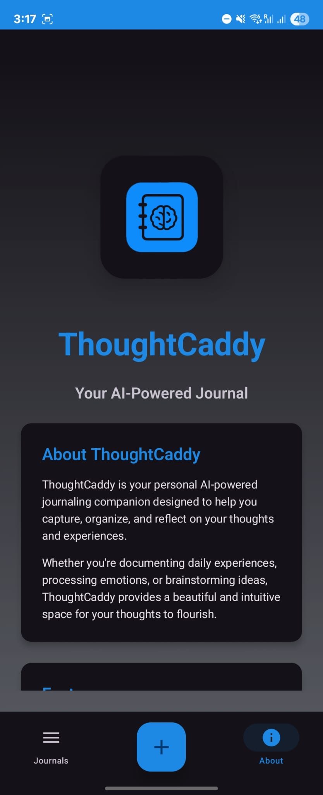
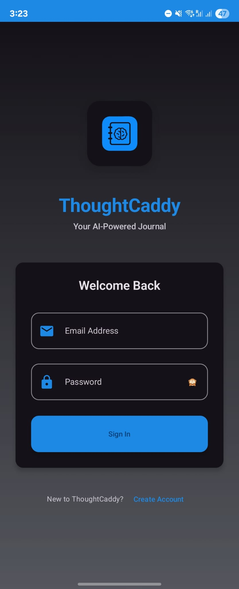
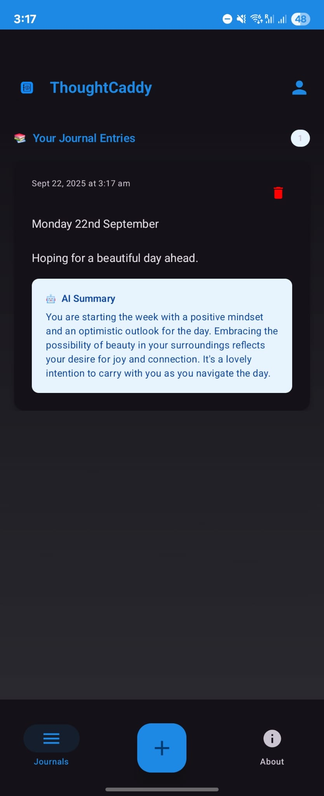
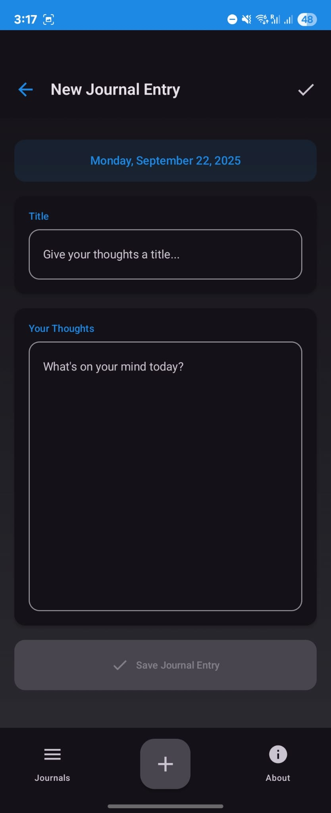

# ThoughtCaddy
*Your AI-Powered Journal*

ThoughtCaddy is your personal **AI-powered journaling companion** designed to help you capture, organize, and reflect on your thoughts and experiences.
Built with **Kotlin**, **Jetpack Compose**, **Firebase**, and **serverless AI summarization**, it provides a clean, modern, and secure journaling experience.

---

# Features

- Create, edit, and view journal entries
- AI-powered summaries and insights (via Firebase Cloud Functions + OpenAI)
- Entries organized by date with search support (Coming Soon)
- Cloud sync with Firestore
- Light/Dark mode support
- Biometric lock for extra privacy (Planned)
- Beautiful Material 3 UI with bottom navigation

---

# Screenshots

<p float="left">
  
  
   
  
  
</p>

---

# Tech Stack

- **Frontend (Android App)**: Kotlin, Jetpack Compose, Material 3
- **Backend**: Firebase Authentication, Firestore
- **AI Integration**: Firebase Cloud Functions (Node.js/TypeScript) + OpenAI API

---

# Getting Started

### 1. Clone the repository

```bash
git clone https://github.com/nirwanrajnp/thoughtcaddy.git
cd thoughtcaddy
```

### 2. Open in Android Studio

- Minimum SDK: 29 (Android 10.0)
- Target SDK: 36

### 3. Configure Firebase

1. Create a Firebase project in the [Firebase Console](https://console.firebase.google.com/).
2. Enable **Authentication (Email/Password)**.
3. Enable **Firestore Database**.
4. Add your Android app (package name: `com.nirwanrn.thoughtcaddy`).
5. Download the `google-services.json` file and place it in `/app`.

### 4. Setup Cloud Functions (AI Summarization)

```bash
cd functions
npm install
firebase functions:config:set openai.key="YOUR_OPENAI_API_KEY"
# then deploy
firebase deploy --only functions
```

### 5. Run the app

Connect a device or emulator and hit **Run** in Android Studio.

---